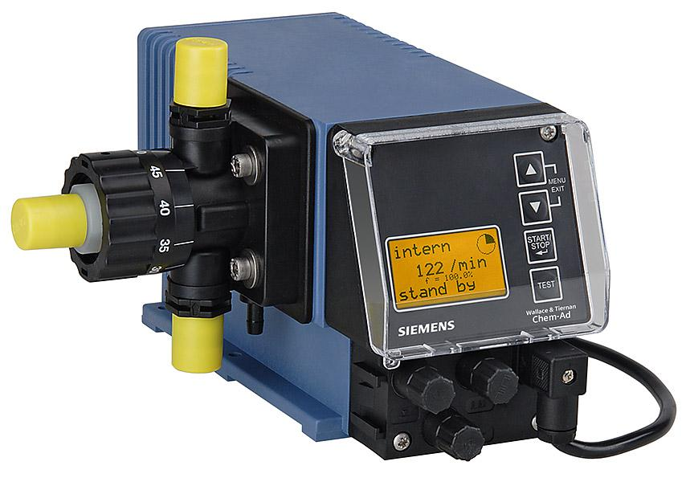

<figure></figure>

    Čerpadlá typového radu ChemAd série A sú membránovo-piestové čerpadlá určené na
    veľmi presné dávkovanie chemických roztokov v priemysle a vodárenských
    prevádzkach.

---

Dvojstupňový princíp čerpania zabraňuje zavzdušňovaniu hlavy čerpadla.

### Použitie

1. **Automatické dávkovanie** (regulácia od externej veličiny)
2. **Dávkovanie štart/stop** (časová regulácia)

Nominálny výkon čerpadla možno plynulo regulovať zmenou frekvencie a výšky
zdvihu. Elektronická výbava čerpadla umožňuje plno-automatickú prevádzku v
závislosti od externých impulzov alebo prúdového signálu.

<figure style="width: 12cm; float: left; margin-left: 0">
    
Technické dáta

    <table>
        <tr>
            <th>Max. výkon</th>
            <td>0,2 l/h, 0,5 l/h, 0,9 l/h, 1,4 l/h</td>
        </tr>
        <tr>
            <th>Maximálny protitlak</th>
            <td>1 MPa</td>
        </tr>
        <tr>
            <th>Počet zdvihov</th>
            <td>122/min</td>
        </tr>
        <tr>
            <th>Max. výška sania</th>
            <td>2 m (pri 100% zdvihu)</td>
        </tr>
        <tr>
            <th>Napájanie a príkon</th>
            <td>230 V, 50Hz, 18,7 W</td>
        </tr>
        <tr>
            <th>Krytie</th>
            <td>IP 65</td>
        </tr>
        <tr>
            <th>Vstup – konektor č.1</th>
            <td>Plaváky odbernej zostavy</td>
        </tr>
        <tr>
            <th>Vstup – konektor č.2</th>
            <td>Riadiaci impulz (REED)</td>
        </tr>
        <tr>
            <th>Výstup – konektor č.3</th>
            <td>Beznapäťový kontakt MIN1 (výstraha), MIN2 (stop)</td>
        </tr>
        <tr>
            <th>Hmotnosť</th>
            <td>2,4 kg</td>
        </tr>
    </table>
</figure>

<figure style="width: 5.5cm">
    
Materiál

    <table>
        <tr>
            <th>Hlava čerpadla</th>
            <td>PVDF</td>
        </tr>
        <tr>
            <th>Piest</th>
            <td>Keramika</td>
        </tr>
        <tr>
            <th>Membrána</th>
            <td>PTFE-EPDM</td>
        </tr>
        <tr>
            <th>Tesnenia</th>
            <td>FPM/Viton B</td>
        </tr>
        <tr>
            <th>Ventily</th>
            <td>PVDF</td>
        </tr>
        <tr>
            <th>Guličky ventilov</th>
            <td>Keramika</td>
        </tr>
    </table>
</figure>

### Voliteľné príslušenstvo

Odberné zostavy, tlakudržiavacie ventily, injekčné ventily, hadičky, plastové
zásobníky.
