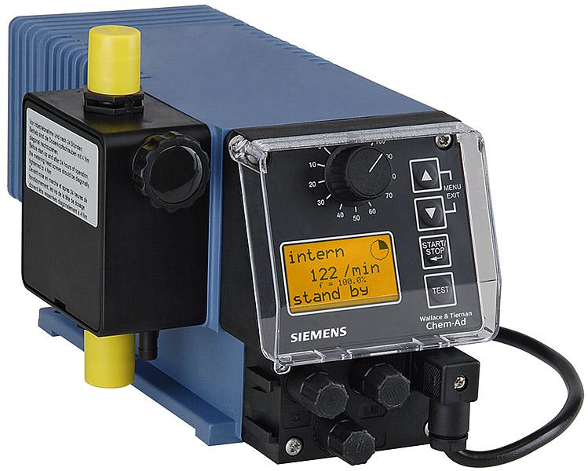

<figure></figure>

    Membránové čerpadlá typového radu ChemAd série B sú určené
    na dávkovanie chemických roztokov vo vodárenských prevádzkach a priemysle.

---

K čerpadlám je k dispozícii bohatý sortiment príslušenstva (odberné
zostavy s MIN-plavákmi, tlak-udržiavace ventily, injekčné
ventily, špeciálne prietokomery, plastové zásobníky, panely i konzoly
a pod.)

Nominálny výkon čerpadiel možno plynulo regulovať zmenou
frekvencie a výšky zdvihu. Elektronická výbava čerpadiel umožňuje
automatickú prevádzku v závislosti od externých impulzov (REED) alebo
prúdového signálu.

Čerpadlá sú poháňané elektomotorom.

<figure style="margin-left: 0.5em; margin-top: 0">
    <figcaption>Materiál</figcaption>
    <table>
        <tr>
            <th>Hlava čerpadla</th>
            <td>PVDF </td>
        </tr>
        <tr>
            <th>Membrána</th>
            <td>PTFE</td>
        </tr>
        <tr>
            <th>Tesnenia</th>
            <td>FPM/Viton B</td>
        </tr>
        <tr>
            <th>Ventily</th>
            <td>PVDF </td>
        </tr>
        <tr>
            <th>Guličky ventilov</th>
            <td>Keramika</td>
        </tr>
    </table>
</figure>
<figure class="block" style="width: 12.5cm">
    <figcaption>Technické dáta</figcaption>
    <table>
        <tr>
            <th>Výkon (l/h)</th>
            <td>1,4</td>
            <td>2,5</td>
            <td>4,8</td>
            <td>4,3</td>
            <td>7,2</td>
            <td>7,2</td>
            <td>11,2</td>
        </tr>
        <tr>
            <th>Maximálny protitlak** (MPa)</th>
            <td>1**</td>
            <td>1**</td>
            <td>0,4</td>
            <td>1</td>
            <td>0,6</td>
            <td>1</td>
            <td>0,5</td>
        </tr>
        <tr>
            <th>Počet zdvihov (1/min)</th>
            <td>122</td>
            <td>122</td>
            <td>122</td>
            <td>122</td>
            <td>122</td>
            <td>122</td>
            <td>122</td>
        </tr>
        <tr>
            <th>Max. dávka na 1 zdvih (cm³)</th>
            <td>0,19</td>
            <td>0,34</td>
            <td>0,65</td>
            <td>0,57</td>
            <td>0,98</td>
            <td>0,98</td>
            <td>1,5</td>
        </tr>
        <tr>
            <th>Max. výška sania</th>
            <td colspan="7">2 m (pri 100 % zdvihu)</td>
        </tr>
        <tr>
            <th>Napájanie</th>
            <td colspan="7">230 V/50 Hz</td>
        </tr>
        <tr>
            <th>Priemerný príkon (W)</th>
            <td>10,4</td>
            <td>10,4</td>
            <td>10,4</td>
            <td>18,7</td>
            <td>18,7</td>
            <td>30</td>
            <td>30</td>
        </tr>
        <tr>
            <th>Prúdové zaťaženie (mA)</th>
            <td>45</td>
            <td>45</td>
            <td>45</td>
            <td>81</td>
            <td>81</td>
            <td>130</td>
            <td>130</td>
        </tr>
        <tr>
            <th>Krytie</th>
            <td colspan="7">IP 65</td>
        </tr>
        <tr>
            <th>Vstup (konektor č. 1)</th>
            <td colspan="7">Od plavákov odbernej zostavy</td>
        </tr>
        <tr>
            <th>Vstup (konektor č.2)</th>
            <td colspan="7">Riadiace impulzy (REED)</td>
        </tr>
        <tr>
            <th>Výstup (konektor.č 3)</th>
            <td colspan="7">Beznapäťový kontakt MIN1 (výstraha) MIN2 (stop)</td>
        </tr>
    </table>
    

        ** K dispozícii sú i čerpadlá ChemAd-B HP určené do protitlaku 1,6 MPa.
    

</figure>

### Voliteľné príslušenstvo

* Odberné zostavy
* Tlakudržiavacie ventily
* Injekčné ventily
* Hadičky
* Plastové zásobníky

