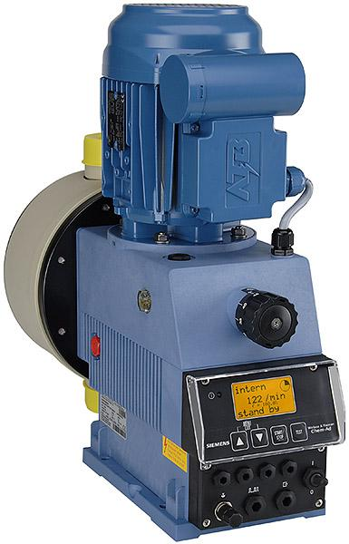

<figure></figure>

    Membránové čerpadlá typového radu ChemAd série D sú
    určené na dávkovanie chemických roztokov vo vodárenských prevádzkach i
    priemysle.

---

K čerpadlám je k dispozícii bohatý sortiment príslušenstva (odberné
zostavy s MIN-plavákmi, tlak-udržiavace ventily, injekčné ventily,
PP-zásobníky, konzoly a pod.)

Výkon čerpadiel možno plynulo regulovať manuálne zmenou výšky zdvihu.

Pohon čerpadla zabezpečuje elektomotor s jednofázovým napájaním 230 V.

<figure class="block" style="float: left">
    <figcaption>Materiál</figcaption>
    <table>
        <tr>
            <th>Hlava čerpadla</th>
            <td>PP, PVDF, nerez</td>
        </tr>
        <tr>
            <th>Membrána</th>
            <td>PTFE-EPDM</td>
        </tr>
        <tr>
            <th>Tesnenia</th>
            <td>FPM, EPDM</td>
        </tr>
        <tr>
            <th>Guličky ventilov</th>
            <td>Keramika, PTFE, nerez</td>
        </tr>
    </table>
</figure>

<figure class="block" style="clear: both">
    <figcaption>Technické dáta</figcaption>
    <table>
        <tr style="text-align: right">
            <th style="width: 5cm">Výkon (l/h)</th>
            <th style="text-align: right">16</th>
            <th style="text-align: right">25</th>
            <th style="text-align: right">54</th>
            <th style="text-align: right">80</th>
            <th style="text-align: right">120</th>
        </tr>
        <tr style="text-align: right">
            <th>Výkon (l/h)</th>
            <td>140</td>
            <td>210</td>
            <td>450</td>
            <td>630</td>
            <td>750</td>
        </tr>
        <tr style="text-align: right">
            <th>Maximálny protitlak (MPa)</th>
            <td>1</td>
            <td>0,8</td>
            <td>0,6</td>
            <td>0,4</td>
            <td>0,3</td>
        </tr>
        <tr style="text-align: right">
            <th>Počet zdvihov (1/min)</th>
            <td>120</td>
            <td>120</td>
            <td>120</td>
            <td>120</td>
            <td>144</td>
        </tr>
        <tr style="text-align: right">
            <th>Max. dávka na 1 zdvih (cm³)</th>
            <td>19,4</td>
            <td>29,2</td>
            <td>62,5</td>
            <td>87,5</td>
            <td>87,5</td>
        </tr>
        <tr>
            <th>Max. výška sania</th>
            <td colspan="5" style="text-align: center">2 m (pri 100% zdvihu)</td>
        </tr>
        <tr>
            <th>Napájanie</th>
            <td colspan="5" style="text-align: center">230 V/50 Hz</td>
        </tr>
        <tr style="text-align: right">
            <th>Priemerný príkon (kW)</th>
            <td>0,3</td>
            <td>0,3</td>
            <td>0,3</td>
            <td>0,3</td>
            <td>0,3</td>
        </tr>
        <tr style="text-align: right">
            <th>Prúdové zaťaženie (A)</th>
            <td>2,3</td>
            <td>2,3</td>
            <td>2,3</td>
            <td>2,3</td>
            <td>2,3</td>
        </tr>
        <tr>
            <th>Krytie</th>
            <td colspan="5" style="text-align: center">IP 55</td>
        </tr>
        <tr>
            <th>Hmotnosť</th>
            <td colspan="5" style="text-align: center">Cca. 25 kg</td>
        </tr>
    </table>
</figure>
