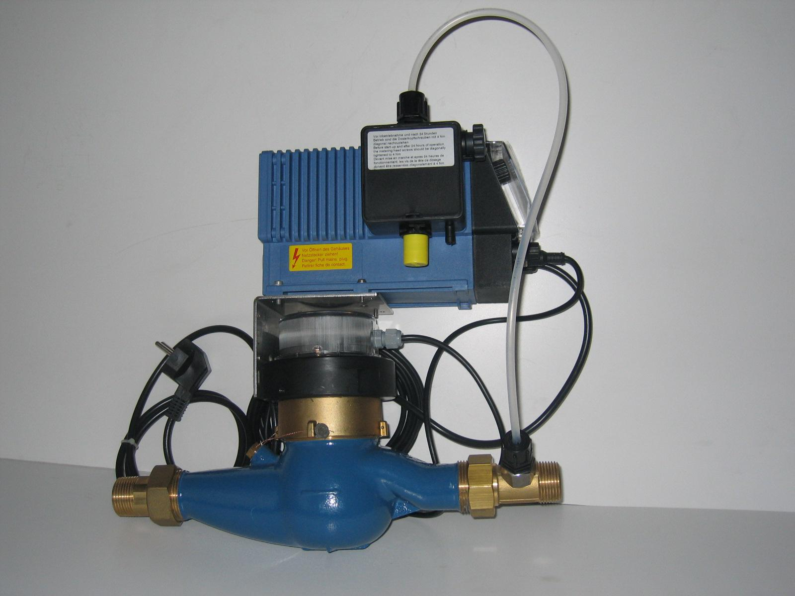

<figure></figure>

    ChemAd-Kompakt je zariadenie určené na plnoautomatické
    dávkovanie chemikálií do vody. Vodomer sa inštaluje priamo do potrubia,
    dávkovacie čerpadlo je na konzole pri vodomere.

---

### Pozostáva z:

* Vodomeru s vysielačom impulzov
* Dávkovacieho  čerpadla
* Odbernej zostavy
* Injekčného ventilu integrovaných do jedného celku

### Oblasť použitia

* Plnoautomatická dezinfekcia vody samostatných objektov
* Doplnková dezinfekcia vody do vodovodnej prípojky
* Chemické ošetrovanie potrubných systémov  

### Princíp činnosti

Membránové dávkovacie čerpadlo ChemAd-B je priamo riadené od impulzov
vysielaných z vodomeru. Jednému impulzu sa dá priradiť i viac zdvihov (režim
násobičky) alebo viacerým impulzom sa priradí jeden zdvih (režim deličky).
Roztok sa nasáva cez odbernú zostavu (jednoduchá alebo s plavákmi), ktorá je
inštalovaná v zásobníku (20 l, 40 l). Dávkovaná chemikália je cez injekčný ventil
zaústená priamo za vodomer.

### Pripravenosť k montáži

* Zásuvka 230 V, 50 Hz, 10 A
* Montážny priestor v trase dl. cca 500 mm

<figure class="block">
    <figcaption>Technické dáta</figcaption>
    <table>
        <tr>
            <th>DN</th>
            <td>20</td>
            <td>25</td>
            <td>40</td>
            <td>50</td>
        </tr>
        <tr>
            <th>Vodomer MNR-K</th>
            <td>3/4“</td>
            <td>1“</td>
            <td>6/4“</td>
            <td>2“</td>
        </tr>
        <tr>
            <th>Max.prietok</th>
            <td>5 m³/h</td>
            <td>7,5 m³/h</td>
            <td>12 m³/h</td>
            <td>18 m³/h</td>
        </tr>
        <tr>
            <th>Hodnota REED</th>
            <td>1 l/imp.</td>
            <td>1 l/imp.</td>
            <td>10 l/imp.</td>
            <td>10 l/imp.</td>
        </tr>
        <tr>
            <th>Výkon čerpadla</th>
            <td colspan="4">1,4 l/h</td>
        </tr>
        <tr>
            <th>Dávka</th>
            <td colspan="4">0,19 cm³/zdvih</td>
        </tr>
        <tr>
            <th>Max. protitlak</th>
            <td colspan="4">1 MPa</td>
        </tr>
        <tr>
            <th>Max. sacia výška</th>
            <td colspan="4">1,5 m</td>
        </tr>
        <tr>
            <th>Príkon</th>
            <td colspan="4">10,4 W</td>
        </tr>
        <tr>
            <th>Napájanie</th>
            <td colspan="4">230 V/50 Hz</td>
        </tr>
        <tr>
            <th>Krytie</th>
            <td colspan="4">IP 65</td>
        </tr>
        <tr>
            <th>Pripojenie zariadenia</th>
            <td>R3/4"</td>
            <td>R1"</td>
            <td>R11/2"</td>
            <td>príruba</td>
        </tr>
    </table>
</figure>
