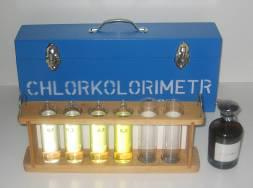

<figure></figure>

    Pri dezinfekcii vody chlórom je potrebné kontrolovať úroveň hodnoty chlóru
    vo vode. Najjednoduchší a najekonomickejší spôsob je pomocou
    chlórkolorimetra.

---

Chlórkolorimeter je jednoduchý analyzátor chlóru vo vode. Meria:

* Voľný chlór
* Celkový chlór

Prítomnosť chlóru vo vzorke  vody sa prejaví po pridaní reagenčného roztoku
(ortotholidinu) žltým až oranžovým sfarbením. Porovnaním takto sfarbenej vzorky
s dodanými etalónmi 0,1 · 0,2 · 0,6 · 0,5 mg/l sa určí skutočný obsah chlóru vo vode.

### Chlórkolorimeter sa dodáva v kufríku s obsahom:

* 2 ks skúmavky na vzorky
* 4 ks etalóny 0,1 · 0,2 · 0,3 · 0,5 mg/l
* 150 ml ortotholidin
