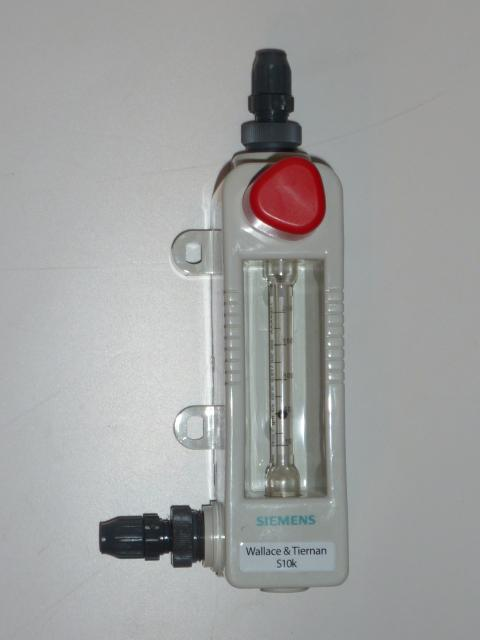

<figure></figure>

    Chlorátor S-10k je plnovákuový dávkovací prístroj plynného chlóru určený
    pre malé a stredné chlórovne s plynulo nastaviteľným výkonom až do 
    4000 g Cl₂/h.

---

Tento typ chlorátora je vhodný pre vodárenské prevádzky, kde sa výrazne nemení
prietok hygienicky zabezpečovanej vody, resp. kde postačuje ručná regulácia
výkonu.

Chlorátor S-10k  sa často využíva v bazénovej technológii.

Chlorátor S-10k sa vyznačuje jednoduchou  montážou, ľahkou obsluhou, vysokou
bezpečnosťou, dlhou životnosťou a nízkymi nárokmi na údržbu.

### Výhody

* Vedľa seba možno zapojiť i niekoľko chlorátorov, čo umožňuje dávkovanie chlóru
  do viacerých miest alebo zálohovanie dávkovania.

* Chlorátory možno pripojiť buď na jednu fľašu alebo na dve s ich automatickým
  prepínaním po vyprázdnení.

* Zapnutie a vypnutie chlórovania môže byť plnoautomatické ovládaním tlakovej
  vody k injektoru (elektromagnetickým ventilomalebo posilňovacím čerpadlom).

<figure class="block">
    
Technické dáta

    <table>
        <tr>
            <th>Výkon g Cl₂/h</th>
            <td>
                1,2–24 |
                3–60 |
                5–100 |
                10–200 |
                20–400 |
                30–600 |
                50–1000 |
                75–1500 |
                100–2000 |
                150–3000 |
                200–4000
            </td>
        </tr>
        <tr>
            <th>Rotameter</th>
            <td>3“ sklenený</td>
        </tr>
        <tr>
            <th>Regulácia výkonu</th>
            <td>V-dýza logaritmická W&T</td>
        </tr>
        <tr>
            <th>Pripojenie chlóru</th>
            <td>Flexibilné PE 1/4“ alternatívne PE 3/8“</td>
        </tr>
        <tr>
            <th>Max. vzdialenosti</th>
            <td>
                <strong>Chlorátor–injektor:</strong>
                <ul>
                    <li>240 m pre 400 g/h</li>
                    <li>40 m   pre 1000 g/h</li>
                </ul>
                <strong>Podtlakový reg. ventil–chlorátor:</strong>
                <ul>
                    <li>140 m pre 400 g/h</li>
                    <li>24 m pre 1000 g/h</li>
                </ul>
            </td>
        </tr>
        <tr>
            <th>Montáž</th>
            <td>Na stenu na platni 200 x 300 mm</td>
        </tr>
    </table>
</figure>
