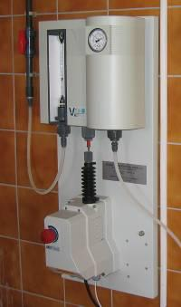

<figure></figure>

    Chlorátor V-10k je plnovákuový dávkovací prístroj plynného chlóru určený
    pre chlórovne, kde sa počíta s automatickou reguláciou alebo diaľkovým
    ovládaním.

---

Tento typ chlorátora je vhodný pre vodárenské prevádzky, kde sa
vyžaduje plnoautomatické chlórovanie z dôvodu **premenlivého prietoku vody**
resp. kde je požiadavka na diaľkové ovládanie dávkovania.

Vedľa seba možno zapojiť i niekoľko chlorátorov, čo umožňuje dávkovanie
chlóru do viacerých miest alebo zálohovanie dávkovania.

Chlorátory možno pripojiť buď na jednu fľašu alebo na dve s ich automatickým
prepínaním po vyprázdnení.

Zapnutie a vypnutie chlórovania môže byť plnoautomatické (ovládaním tlakovej
vody k injektoru elektromagnetickým ventilom alebo posilňovacím čerpadlom).

Chlorátor V-10k sa vyznačuje jednoduchou montážou, ľahkou obsluhou, vysokou 
bezpečnosťou, dlhou životnosťou a nízkymi nárokmi na údržbu.

<figure class="block" style="clear: both">
    
Technické dáta

    <table>
        <tr>
            <th style="width: 4cm">Výkon g Cl₂/h</th>
            <td>
                3–60 · 10–200 · 20–400 · 30–600 · 50–1000 · 75–1500 · 100–2000 · 150–3000 · 200–4000 · 250–5000 · 300–6000 · 400–8000 · 500–10000
            </td>                       
        </tr>
        <tr>
            <th>Rotameter</th>
            <td>5" sklenený</td>
        </tr>
        <tr>
            <th>regulácia výkonu </th>
            <td>V-dýza lineárna W&T</td>
        </tr>
            <th>Regulačný rozsah</th>
            <td>1:20 (presnosť ±4 %)</td>
        </tr>
        <tr>
            <th>Pracovný podtlak</th>
            <td>-40– -200 mbar</td>
        </tr>
        <tr>
            <th>Pripojenie chlóru</th>
            <td>
                <ul>
                    <li>Flexibilné PE 1/4"</li>
                    <li>Alternatívne PE 3/8"</li>
                </ul>
            </td>
        </tr>
        <tr>
            <th>Elektrické pripojenie</th>
            <td>230 V, 50 Hz, 19 mA</td>
        </tr>
        <tr>
            <th>Výstup</th>
            <td>
                <ul>
                    <li>0–1 kOhm = výkon chlorátora</li>
                    <li>Beznapäťový kontakt (režim auto/man)</li>
                </ul>
            </td>
        </tr>
        <tr>
            <th>Doba chodu pohonu</th>
            <td>80 s</td>   
        </tr>
        <tr>
            <th>Nastavovanie výkonu</th>
            <td>
                <ul>
                    <li>Miestne (ručne)</li>
                    <li>Diaľkovo (elektricky)</li>
                    <ul>
                        <li>diaľkové ovládanie</li>
                        <li>automatická regulácia</li>
                    </ulL
                </ul>
            </td>                                                                                                
        </tr>
        <tr>
            <th>Montáž</th>
            <td>Na stenu</td>
        </tr>
    </table>
</figure>
